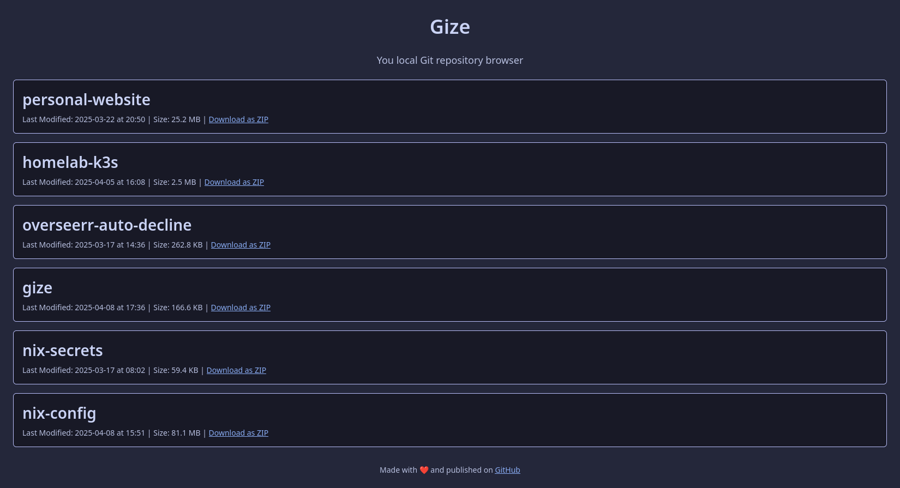

# Gize

  

A lightweight web app to display your local Git repositories. Easily browse repo names, view metadata, and download ZIP archives on the fly.

This project was built for my own (admittedly narrow) use case: I wanted a simple way to display a list of Git repositories that are automatically backed up to my server. Tools like [GitLab](https://about.gitlab.com/) and [Forgejo](https://forgejo.org/) are great, but far too heavy for my needs as I am just using a fraction of their features. So, I made something leaner.

The name comes from the combination of the words "Gaze" and "Git".

## Project Status

I have since moved to [gogs](https://gogs.io/), which also fullfills my needs. Dependency updates and such will be merged, sometimes even a release will be created. I won't do new features though. If you want those, create a PR and I am happy to merge those.

## Screenshots


</img>

## Build

To build the container yourself, simply clone the repository and then build the container with the provided docker file. You can the run it as described in the section below.

```shell
docker build --tag gize .
```

Alternatively you can build the binary directly with Go.

```shell
go build -o ./gize
```

## Run

The easiest way to run Gize, is to use the provided container.

```shell
docker run -d \
  -e GIZE_ROOT="/repositories" \
  -v ./path/to/your/repositories:/repositories \
  -p 8080:8080 \
  ghcr.io/masterevarior/gize:latest
```

You should now see the UI at http://localhost:8080

### Environment Variables

| Name | Description | Default | Example | Mandatory |
|------------------|------------------------------------------------------------|-----------------------------------------------------------------------------------------|---------------------|------------|
| GIZE_ROOT | The Path to your directory where all your repositories are | | `/repositories` | ✅ |
| GIZE_TITLE | Title that should be displayed | Gize | My cool title | ❌ |
| GIZE_DESCRIPTION | Description that should be displayed under the title | Your local Git repository browser | My cool description | ❌ |
| GIZE_FOOTER | Content of the footer, this allows for HTML | Made with ❤️ and published on <a href='https://github.com/MasterEvarior/gize'>GitHub</a>| My cool footer | ❌ |
| GIZE_PORT | Port | `:8080` | `:8455` | ❌ |
| GIZE_ENABLE_DOWNLOAD | Wether or not to enable the ability to download a repository as a ZIP | `false` |`true` | ❌ |
| GIZE_ENABLE_CACHE | Wether or not to enable a simply in-memory cache to speed up subsequent loads. The livetime is 300s by default. | `false` |`true` | ❌ |

## Deployment

With Docker compose:

```yaml
services:
  gize:
    image: ghcr.io/masterevarior/gize:latest
    ports:
      - "8080:8080"
    environment:
      - GIZE_ROOT=/repositories
    volumes:
      - ./path/to/your/repositories:/repositories
    restart: unless-stopped
```

## Development

### Linting

Linting is done with [golangci-lint](https://golangci-lint.run/), which can be run like so:

```shell
golangci-lint run
```

Run all other linters with the treefmt command. Note that the command does not install the required formatters.

```shell
treefmt
```

### Git Hooks

There are some hooks for formatting and the like. To use those, execute the following command:

```shell
git config --local core.hooksPath .githooks/
```

### Nix

If you are using [NixOS or the Nix package manager](https://nixos.org/), there is a dev shell available for your convenience. This will install Go, everything needed for formatting, set the Git hooks and some default environment variables. Start it with this command:

```shell
nix develop
```

If you happen to use [nix-direnv](https://github.com/nix-community/nix-direnv), this is also supported.

## Improvements, issues and more

Pull requests, improvements and issues are always welcome.
